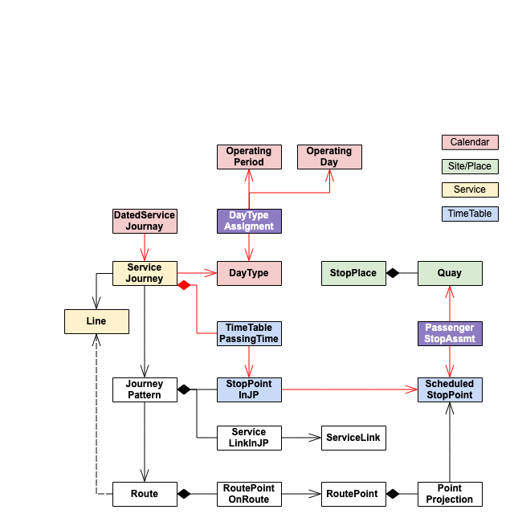

# netex-tools
Tools to parse, filter, validate (?) and transform Netex data files. This tool should not be specific to the "Nordic"
profile, but we will only implement support for elements/types used by it. If you find this tool incomplete, please
request an improvement or contribute to it through GitHub.


This tool is WORK-IN-PROGRESS

## Filter lib Wishlist / Goals

 - [x] Filter a data set and output a new dataset
   - [ ] Filter stops using a bounding box (coordinates)
   - [ ] Filter entities on ids
     - [x] Lines [Pri 2]
     - [x] ServiceJournies [Pri 2]
   - [ ] Filter on time-period
 - [ ] Validating that the data is according to a given NeTEx profile would be useful. [Later]
 - [ ] Saving the result in specific profiles. [Later] 


## netex-tools-lib

This is a Kotlin library that can be used in a Java/Kotlin app to filter NeTEx data. The lib can 
be used to build a model (`EntityModel`) and select entities from this. The model only contains
entities with id and type(xml element) and relations. This model is build using the Netex naming
conventions: 
  - Entities are elements "id" attribute
  - A relation from an entity exists if a child element has a "ref" attribute. The "ref" value 
    should be identical to another entity id.

Note! Versioning is not supported. 

See tests and the `netex-tools-cli` main for an example on usage.


## netex-tools-cli

A java main that takes 3 arguments:
 - A config file with filtering rules
 - An input source (directory, zip not supported yet)
 - An output dir


### config file

Note! The parser does not accept comment, so you need to remove the comments
to use the example below.

```json
{
  "logLevel" : "INFO",
  
  "doc1" :  "Print a report with entities and relations witch summarize the number of selected entities and the total number of entities in the datasource.",
  "printReport" : true,
  
  "doc2" :  "NOT IMPLEMENTED!", 
  "doc3" :  "Keep all locations (Quays, StopPlaces ...) inside the polygon/bounding box defined by the coordinates. StopPlaces are kept if one quay is inside the area.",
  "area" : "60.0 10.0 60.0 10.0",

  "doc4" :  "NOT IMPLEMENTED!", 
  "doc5" :  "Include services witch operate in period (inclusive, exclusive)",
  "period" : {
    "start" : "2024-01-01",
    "end" : "2024-12-31"
  },
  
  "doc6" :  "Include the following lines, these are merged with the serviceJourneys and flex-lines",
  "lines" : [
    "NNN:Line:500"
  ],
  
  "doc7" :  "Include the following service journeys, these are merged with the lines and flex-lines",
  "serviceJourneys" : [
    "NNN:ServiceJourney:310_12"
  ],
  
  "doc8" :  "Include the following flexible lines, these are merged with the lines and service journeys",
  "flexLines" : [
    "NNN:FlexLine:1"
  ],
  
  "doc9" : "These elements are skipped, nested elements are skipped as well. The list included here is are all not parsed by OTP or optional (Notice).", 
  "skipElements" : [
    "AccessibilityAssessment",
    "AlternativeName",
    "keyList",
    "FromPointRef",
    "GroupOfStopPlaces",
    "NoticeAssignment",
    "NoticeRef",
    "NoticedObjectRef",
    "Parking",
    "ParkingProperties",
    "placeEquipments",
    "ServiceLink",
    "TopographicPlace",
    "TopographicPlaceRef",
    "TariffZone",
    "TariffZoneRef",
    "ToPointRef"
  ],
  
  "doc10" :  "The alias is used in the report only to shorten the lines",
  "alias" : [
    "CompositeFrame CF",
    "ResourceFrame RF",
    "ServiceCalendarFrame SCF",
    "ServiceFrame SF",
    "Network NW",
    "TimetableFrame TTF",
    "SiteFrame SF",
    "StopPointInJourneyPattern SPInJP"
  ]
}
```

An entity is only kept if all fliter rules are satisfied. If no filter rule is defined for a type, 
the normal cascade deleting applies.

#### Report
The cli will by default print a report. The report contains a _count_ and the total in the source data for the 
selected entities and relationships. The report is useful when setting up a new filter and can also be used to analyze
the data entity/relationships.

<details>
  <summary>Example entity/relationship report</summary>

The alias in the config file is used in the report. For example, `CF`in the report means `CompositeFrame`.  

```
SELECTED ENTITIES

CF                                                    2      4
CF/AvailabilityCondition                              ·      4
CF/Codespace                                          ·      2
CF/RF                                                 1      2
CF/RF/Authority                                       ·      1
CF/RF/Operator                                        1     12
CF/SCF                                                1      2
CF/SCF/DayType                                        1    372
CF/SCF/DayTypeAssignment                              8   5345
CF/SCF/OperatingPeriod                                1   1492
CF/SF                                                 2      5
CF/SF/DestinationDisplay                              2   1638
CF/SF/FlexibleLine                                    ·      1
CF/SF/FlexibleStopAssignment                          ·    316
CF/SF/FlexibleStopPlace                               ·    316
CF/SF/FlexibleStopPlace/FlexibleArea                  ·    316
CF/SF/JourneyPattern                                  1     24
CF/SF/JourneyPattern/SPInJP                          30    638
CF/SF/JourneyPattern/ServiceLinkInJourneyPattern      ·    613
CF/SF/Line                                            1      1
CF/SF/NW                                              1      2
CF/SF/NW/GroupOfLines                                 1      3
CF/SF/Notice                                          ·    101
CF/SF/PassengerStopAssignment                        30   8699
CF/SF/Route                                           1     24
CF/SF/Route/PointOnRoute                              ·    638
CF/SF/RoutePoint                                      ·   9015
CF/SF/RoutePoint/PointProjection                      ·   9015
CF/SF/ScheduledStopPoint                             30   9015
CF/TTF                                                1      2
CF/TTF/ServiceJourney                                 1    134
CF/TTF/ServiceJourney/FlexibleServiceProperties       ·      2
CF/TTF/ServiceJourney/TimetabledPassingTime          30   3866
CF/TTF/ServiceJourneyInterchange                      ·     56
RF                                                    ·      1
RF/PurposeOfGrouping                                  ·      1
SF                                                    1      1
SF/StopPlace                                         30   5760
SF/StopPlace/Quay                                    30  10621
SF/StopPlace/Quay/BoardingPosition                    ·     68


SELECTED REFERENCES

AuthorityRef CF/SF/NW -> CF/RF/Authority                                                  ·      2
DayTypeRef CF/SCF/DayTypeAssignment -> CF/SCF/DayType                                     8   5345
DayTypeRef CF/TTF/ServiceJourney -> CF/SCF/DayType                                        1    134
DestinationDisplayRef CF/SF/JourneyPattern/SPInJP -> CF/SF/DestinationDisplay             2     39
FlexibleLineRef CF/SF/Route -> CF/SF/FlexibleLine                                         ·      1
FlexibleStopPlaceRef CF/SF/FlexibleStopAssignment -> CF/SF/FlexibleStopPlace              ·    316
FromJourneyRef CF/TTF/ServiceJourneyInterchange -> Ø                                      ·     56
JourneyPatternRef CF/TTF/ServiceJourney -> CF/SF/JourneyPattern                           1    134
LineRef CF/SF/Route -> CF/SF/Line                                                         1     23
LineRef CF/TTF/ServiceJourney -> CF/SF/Line                                               1    132
OperatingPeriodRef CF/SCF/DayTypeAssignment -> CF/SCF/OperatingPeriod                     1   1492
OperatorRef CF/SF/FlexibleLine -> CF/RF/Operator                                          ·      1
OperatorRef CF/SF/Line -> CF/RF/Operator                                                  1      1
OperatorRef CF/TTF/ServiceJourney -> CF/RF/Operator                                       1    132
ParentSiteRef SF/StopPlace -> SF/StopPlace                                                ·    173
ProjectToPointRef CF/SF/RoutePoint/PointProjection -> CF/SF/ScheduledStopPoint            ·    316
ProjectedPointRef CF/SF/RoutePoint/PointProjection -> CF/SF/ScheduledStopPoint            ·   8699
QuayRef CF/SF/PassengerStopAssignment -> SF/StopPlace/Quay                               30   8677
QuayRef CF/SF/PassengerStopAssignment -> Ø                                                ·     22
RepresentedByGroupRef CF/SF/FlexibleLine -> CF/SF/NW                                      ·      1
RepresentedByGroupRef CF/SF/Line -> CF/SF/NW/GroupOfLines                                 1      1
RoutePointRef CF/SF/Route/PointOnRoute -> CF/SF/RoutePoint                                ·    638
RouteRef CF/SF/JourneyPattern -> CF/SF/Route                                              1     24
SPInJPRef CF/TTF/ServiceJourney/TimetabledPassingTime -> CF/SF/JourneyPattern/SPInJP     30   3866
ScheduledStopPointRef CF/SF/FlexibleStopAssignment -> CF/SF/ScheduledStopPoint            ·    316
ScheduledStopPointRef CF/SF/JourneyPattern/SPInJP -> CF/SF/ScheduledStopPoint            30    638
ScheduledStopPointRef CF/SF/PassengerStopAssignment -> CF/SF/ScheduledStopPoint          30   8699
ServiceLinkRef CF/SF/JourneyPattern/ServiceLinkInJourneyPattern -> Ø                      ·    613
SiteRef SF/StopPlace -> SF/StopPlace                                                      ·      6
ToJourneyRef CF/TTF/ServiceJourneyInterchange -> CF/TTF/ServiceJourney                    ·     56
```

</details>


#### Algorithm outline

1. Apply all rules to the data set.
   1. For example, filter quays and stop-places based on the `location-box`, `quay-ids`, and `line-ids`.
   2. Filter lines if `line-ids` is defined.
   3. Filter day-types and dated-service-journeys based on `period`
2. Merge and filter relations. 
3. Parse the data again and output selected entities and all child elements, but not necessarily child 
   entities.
   
This diagram might help with filtering relations:



